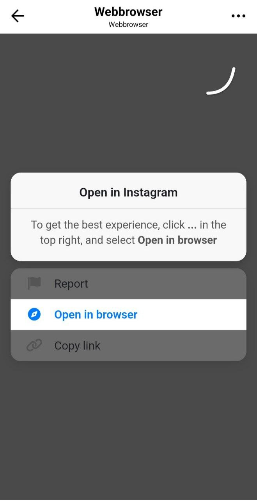

<!DOCTYPE html>
<html lang="ru">
<head>
  <meta charset="UTF-8" />
  <title>Открой в браузере</title>
  <meta name="viewport" content="width=device-width, initial-scale=1">
  
</head>
<body>

</body>
</html>

